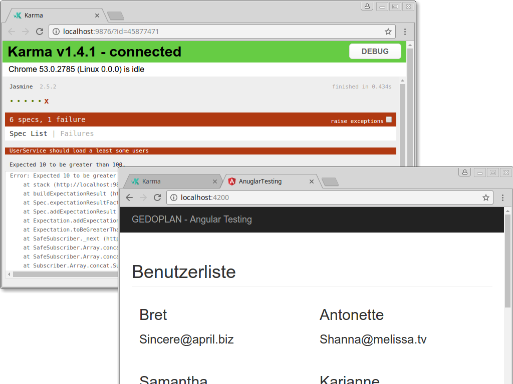

# Angular Testing

Demo-Projekt zum Blog 
[GEDOPLAN](https://javaeeblog.wordpress.com/?p=3870)


Thema: Angular Testen mit Karma und Jasmine
Inhalt:

  - AngularCLI
  - Jasmine
  - Karma




## Development server

Starten per `ng serve` URL: `http://localhost:4200/`. 

## Testen

Starten per `ng test`

```
by GEDOPLAN, Dominik Mathmann
```
